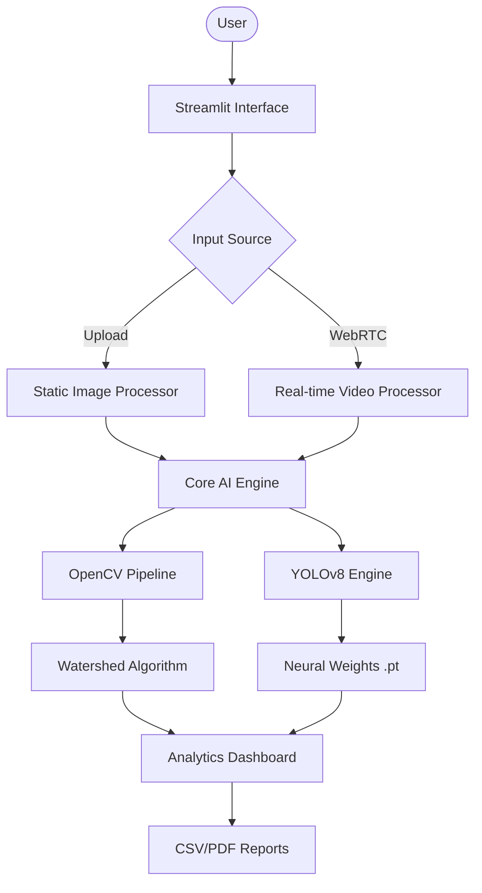

# 🌾 AI Grain Counter (VisionOS v1.2.0)

[](https://www.python.org/downloads/)
[](https://streamlit.io/)
[](https://ultralytics.com/)
[](LICENSE)

An enterprise-grade computer vision solution for automated grain analysis. This system leverages **YOLOv8** and **Adaptive Watershed Algorithms** to provide precision counting, classification, and real-time analytical reporting for agricultural quality control.

## 📖 Table of Contents
- [✨ Core Features](#-core-features)
- [🏗 System Architecture](#-system-architecture)
- [🚀 Quick Start](#-quick-start)
- [📦 Installation](#-installation)
- [⚙️ Configuration](#-configuration)
- [🧪 Testing Suite](#-testing-suite)
- [🛡 Security & Compliance](#-security--compliance)
- [🤝 Contributing](#-contributing)
- [🛠 Technology Stack](#-technology-stack)

## 🛠 Technology Stack
The AI Grain Counter system is built using an industry-standard stack for computer vision and high-performance web applications:
- **Core Engine:** [YOLOv8](https://ultralytics.com/) for high-speed object detection and [OpenCV](https://opencv.org/) for morphological analysis.
- **Frontend Framework:** [Streamlit](https://streamlit.io/) for rapid development of interactive data applications.
- **Deep Learning:** [PyTorch](https://pytorch.org/) backend for neural network inference.
- **Analytics:** [Plotly](https://plotly.com/) for dynamic real-time data visualization.

## ✨ Core Features
- **Dual Detection Engine**: Toggle between high-precision Watershed (OpenCV) and intelligent Object Detection (YOLOv8).
- **Real-Time WebRTC**: Process live video streams with ultra-low latency directly in the browser.
- **Analytical Dashboard**: Live Plotly charts displaying count breakdowns and detection distributions.
- **Export Ready**: One-click CSV export for downstream data analysis and reporting.
- **Dark Mode Optimized**: Premium UI with glassmorphism aesthetics and responsive design.

## 🏗 System Architecture


## 🚀 Quick Start

### Automatic Installation (Recommended)
1. **Clone the Repo:**
   ```bash
   git clone https://github.com/anandmahadev/grain.detector.git
   cd grain.detector
   ```
2. **Execute Automation Script:**
   ```bash
   run_all.bat
   ```
   *This script automates environment creation, dependency resolution, and launches the application.*

### Manual Setup
```bash
python -m venv venv
source venv/bin/activate  # Or `venv\Scripts\activate` on Windows
pip install -r requirements.txt
streamlit run grain_counter.py
```

## 🧠 Model Training

To train the custom YOLOv8 model on your own dataset:
1.  **Prepare Dataset**: Ensure your dataset is in the `sample_rice_pepper_dataset` directory or update the path in `train_custom_yolo.py`.
2.  **Run Training Script**:
    ```bash
    python train_custom_yolo.py
    ```
3.  **Monitor Progress**: Training logs and model weights will be saved in the `runs/` directory.

## 🧪 Testing Suite
Maintain system integrity with our automated test suite, which now includes static asset validation and core logic checks:
```bash
pytest tests/
```

## ⚙️ Troubleshooting
- **GPU Acceleration**: If you have an NVIDIA GPU, ensure CUDA is installed for faster YOLO processing.
- **Camera Access**: If the webcam mode fails, ensure your browser has permissions and no other app is using the camera.
- **Dependency Issues**: Try clearing your environment and re-running `pip install -r requirements.txt`.

## 🗺️ Project Roadmap
- [ ] **v1.3.0**: Mobile-optimized UI and PWA support.
- [ ] **v1.4.0**: Batch processing for entire folders of grain images.
- [ ] **v2.0.0**: Integration with Cloud SQL for historical tracking and trend analysis.

## 🛡 Security & Compliance
We follow strict development standards. Please refer to our [SECURITY.md](SECURITY.md) and [CODE_OF_CONDUCT.md](CODE_OF_CONDUCT.md) for more details.

## 🤝 Contributing
Contributions are what make the open source community such an amazing place to learn, inspire, and create. Any contributions you make are **greatly appreciated**. 

1. Fork the Project
2. Create your Feature Branch (`git checkout -b feature/AmazingFeature`)
3. Commit your Changes (`git commit -m 'Add some AmazingFeature'`)
4. Push to the Branch (`git push origin feature/AmazingFeature`)
5. Open a Pull Request

---
Developed with ❤️ by **Anand Mahadev**  
*Optimized for high-speed agricultural analysis.*
